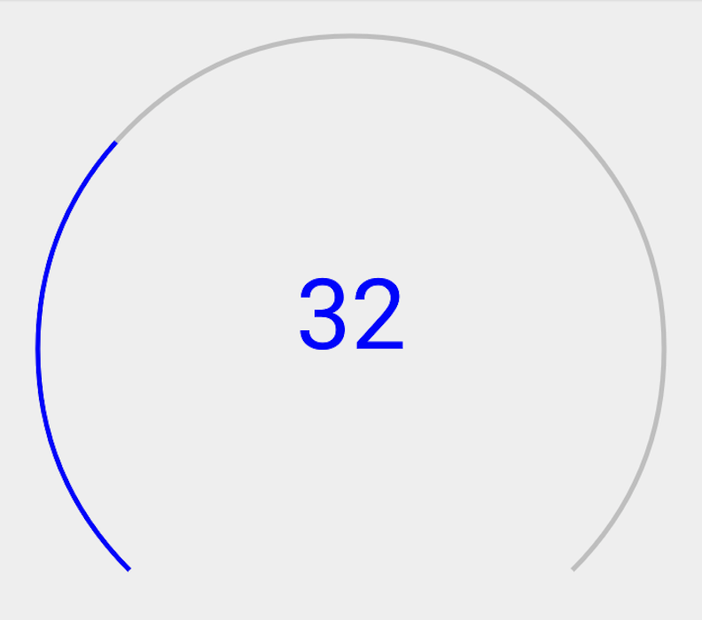
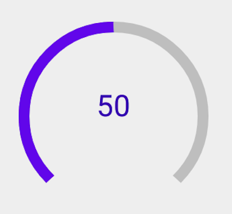

# Circular Slider - Android

This library provides a custom view allowing to set a value by swiping the finger on a circular slider.

## Get started

Implementing this view is really simple, you'll see !

First, add this line into your root build.gradle :

	allprojects {
		repositories {
			...
			maven { url 'https://jitpack.io' }
		}
	}

Then add the dependency into your app build.gradle :

	dependencies {
	        implementation 'com.github.Sildian:CircularSlider-Android:1.1.0'
	}

That's it ! You can now user the Circular Slider into your project. Just write this code into your layout :

    <com.sildian.apps.circularsliderlibrary.CircularSlider
        android:id="@+id/activity_main_circular_slider_1"
        android:layout_width="match_parent"
        android:layout_height="wrap_content"
        android:layout_margin="16dp"/>

## Advanced use cases

### Change color and size

Really easy, look at the sample below :

    <com.sildian.apps.circularsliderlibrary.CircularSlider
        android:id="@+id/activity_main_circular_slider_2"
        android:layout_width="0dp"
        android:layout_height="match_parent"
        android:layout_weight="1"
        android:layout_margin="8dp"
        app:sliderColor="@color/colorPrimary"
        app:sliderWidth="8dp"
        app:valueTextColor="@color/colorPrimaryDark"
        app:valueTextSize="22sp"/>

### Monitor values

#### Set values

Let's go further ! Set a min and max value, as well as a step value :

    <com.sildian.apps.circularsliderlibrary.CircularSlider
        android:id="@+id/activity_main_circular_slider_3"
        android:layout_width="0dp"
        android:layout_height="match_parent"
        android:layout_weight="1"
        android:layout_margin="8dp"
        app:sliderColor="@color/colorPrimary"
        app:valueTextColor="@color/colorPrimaryDark"
        app:valueTextSize="22sp"
        app:minValue="100"
        app:maxValue="1000"
        app:stepValue="100"/>

#### Format values to display

I guess you realized that in this sample the value text is formatted. How can we do that ? In the Main Activity.
First, create a class implementing 'ValueFormatter' and override 'formatValue'.
Then set an instance of your class as 'valueFormatter' of the 'circularSlider'.

	class MainActivity : AppCompatActivity() {

    	override fun onCreate(savedInstanceState: Bundle?) {

        	    super.onCreate(savedInstanceState)
        	    setContentView(R.layout.activity_main)

	            val circularSlider = activity_main_circular_slider_3
      	        circularSlider.valueFormatter = CurrencyFormatter()
    	}

	        private class CurrencyFormatter: ValueFormatter {

    	        override fun formatValue(value: Int, context: Context?): String {
    	                //Return a string, for instance :
        	                return NumberFormat.getCurrencyInstance(Locale.UK).format(value)
        	    }
	        }
	}

#### Listen to value change event

Now if you need to listen the value change event, you can add a callback :

    circularSlider.addOnValueChangedListener { view, value ->
            //Do something
     }

### All attributes

- minValue : integer
- maxValue : integer
- currentValue : integer
- stepValue : integer
- showValueText : boolean
- sliderWidth : dimension
- sliderColor : color
- valueTextSize : dimension
- valueTextColor : color

All attributes can be set in xml or in code.

Hope you'll enjoy this library !
